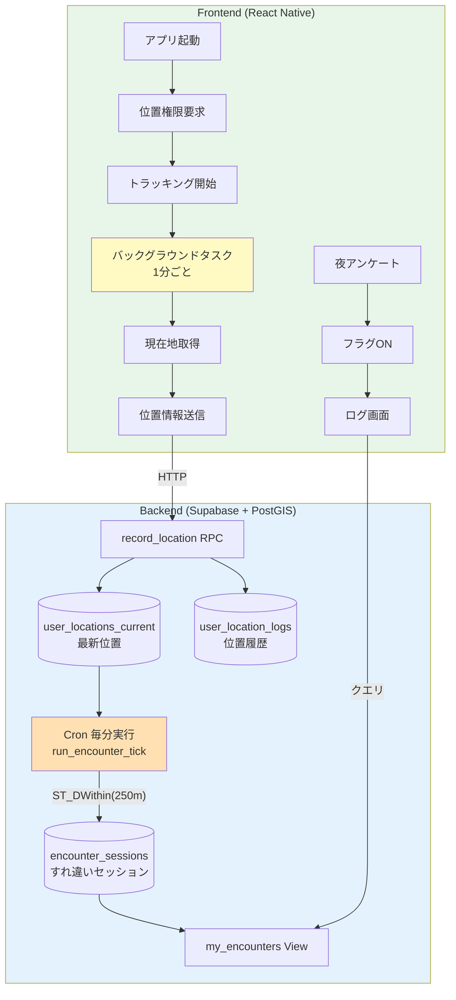
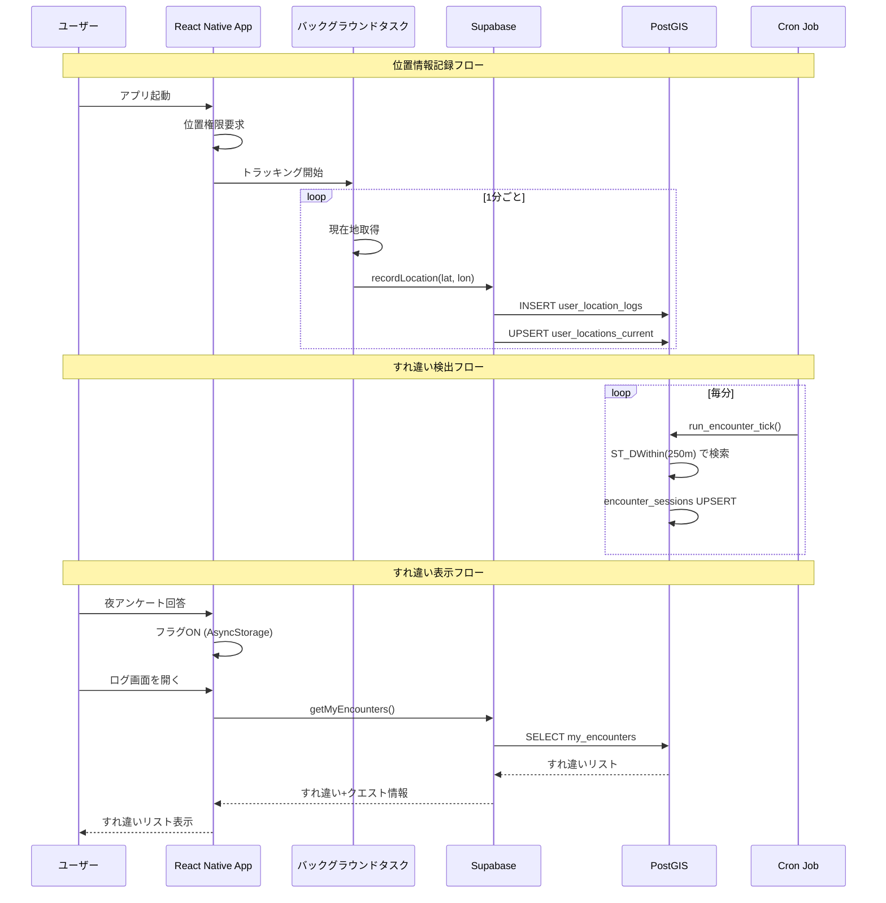
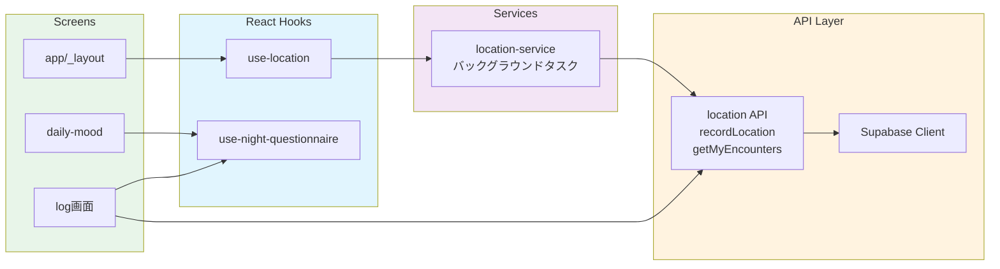

# すれ違い機能（StreetPass）実装ドキュメント

## 概要

3DS のすれ違い通信にインスパイアされた機能です。
PostGIS（Supabase）+ expo-location を活用し、バックグラウンドで位置情報を更新、半径250m以内のユーザーを「すれ違い」として検出します。

夜の気分アンケート回答後、ログ画面にすれ違ったユーザーのリスト（アバター、ユーザー名、達成クエスト）を表示します。

---

## アーキテクチャ

### システム全体図



### データフロー詳細



### コンポーネント構成



---

## 技術スタック

| 領域 | 技術 |
|------|------|
| 位置情報取得 | expo-location |
| バックグラウンドタスク | expo-task-manager |
| 状態管理 | AsyncStorage（夜アンケートフラグ） |
| 地理空間データベース | Supabase + PostGIS |
| 近接検出 | ST_DWithin（250m） |
| 定期実行 | pg_cron（毎分） |

---

## ファイル構成

```
lib/
├── api/
│   ├── location.ts      # 位置情報API（recordLocation, getMyEncounters）
│   ├── types.ts         # 型定義（EncounterSession, CompletedQuest等）
│   └── index.ts         # エクスポート
└── location-service.ts  # バックグラウンドトラッキングサービス

hooks/
├── use-location.ts           # 位置情報フック
└── use-night-questionnaire.ts # 夜アンケートフラグフック

app/
├── _layout.tsx          # アプリ起動時に位置情報トラッキング開始
└── (tabs)/
    ├── daily-mood.tsx   # 夜アンケート送信時にフラグを立てる
    └── log.tsx          # すれ違いリスト表示

app.json                 # iOS/Android位置情報権限設定
```

---

## 主要コンポーネント

### 1. 位置情報サービス (`lib/location-service.ts`)

バックグラウンドで1分ごとに位置情報を取得・送信します。

```typescript
// タスク名
const BACKGROUND_LOCATION_TASK = "BACKGROUND_LOCATION_TASK";

// 主要関数
requestLocationPermissions()  // 権限要求
startLocationTracking()       // トラッキング開始
stopLocationTracking()        // トラッキング停止
isLocationTrackingActive()    // 状態確認
```

**設定値:**
- 更新間隔: 60秒（1分）
- 精度: `Accuracy.Balanced`（バッテリー消費を抑制）
- フォアグラウンドサービス通知: 「すれ違い機能 - 位置情報を記録しています」

### 2. 位置情報API (`lib/api/location.ts`)

```typescript
// 位置情報を記録
async function recordLocation(
  latitude: number,
  longitude: number,
  accuracy?: number
): Promise<void>

// すれ違い一覧を取得
async function getMyEncounters(): Promise<EncounterWithQuests[]>
```

### 3. 夜アンケートフラグ (`hooks/use-night-questionnaire.ts`)

```typescript
const { isCompleted, isLoading, markAsCompleted, reset } = useNightQuestionnaire();

// isCompleted: 今日の夜アンケートが回答済みか
// markAsCompleted(): 回答完了時に呼び出す
// reset(): フラグをリセット（テスト用）
```

**ストレージ形式:**
```json
{
  "date": "2026-01-30",
  "completed": true
}
```

日付が変わると自動的にリセットされます。

### 4. ログ画面 (`app/(tabs)/log.tsx`)

**表示条件:**
- 夜アンケート未回答: ロック画面（「夜の気分を記録するとすれ違った仲間が見られます」）
- 夜アンケート回答済み: すれ違いリスト表示

**表示内容:**
- アバター（未設定時はアプリアイコン）
- ユーザー名（Supabase Auth の `display_name`）
- 今日達成したクエスト（最大3件）
- お疲れ様ボタン

---

## 型定義

```typescript
// すれ違いセッション
interface EncounterSession {
  id: number;
  other_user_id: string;
  other_user_name: string | null;
  other_user_avatar: string | null;
  started_at: string;
  last_seen_at: string;
  ended_at: string | null;
  seen_minutes: number;
  min_distance_m: number;
  last_distance_m: number;
}

// 完了したクエスト
interface CompletedQuest {
  id: number;
  title: string;
  completed_at: string;
}

// すれ違い + クエスト情報
interface EncounterWithQuests extends EncounterSession {
  completed_quests: CompletedQuest[];
}
```

---

## Supabase スキーマ

### テーブル

#### `user_locations_current`（最新位置）

| カラム | 型 | 説明 |
|--------|------|------|
| user_id | uuid (PK) | ユーザーID |
| recorded_at | timestamptz | 記録日時 |
| pos | geography(Point, 4326) | 位置情報 |
| accuracy_m | integer | 精度（メートル） |

#### `user_location_logs`（位置履歴）

| カラム | 型 | 説明 |
|--------|------|------|
| id | bigserial (PK) | ID |
| user_id | uuid | ユーザーID |
| recorded_at | timestamptz | 記録日時 |
| pos | geography(Point, 4326) | 位置情報 |
| accuracy_m | integer | 精度（メートル） |

※7日で自動削除

#### `encounter_sessions`（すれ違いセッション）

| カラム | 型 | 説明 |
|--------|------|------|
| id | bigserial (PK) | ID |
| user_a | uuid | ユーザーA（user_a < user_b） |
| user_b | uuid | ユーザーB |
| started_at | timestamptz | 開始日時 |
| last_seen_at | timestamptz | 最終検出日時 |
| ended_at | timestamptz | 終了日時（null=進行中） |
| seen_minutes | integer | すれ違い時間（分） |
| min_distance_m | numeric | 最小距離（メートル） |
| last_distance_m | numeric | 最終距離（メートル） |

### RPC関数

#### `record_location(p_lat, p_lon, p_accuracy_m, p_recorded_at)`

位置情報を記録します。`user_location_logs` に insert し、`user_locations_current` を upsert します。

#### `run_encounter_tick(p_radius_m, p_fresh_within, p_grace)`

近接ユーザーを検出し、`encounter_sessions` を更新します。

- `p_radius_m`: 検出半径（デフォルト: 250m）
- `p_fresh_within`: 有効な位置情報の時間範囲（デフォルト: 2分）
- `p_grace`: セッション終了の猶予時間（デフォルト: 2分）

### ビュー

#### `my_encounters`

自分のすれ違い一覧を取得するビュー。`auth.uid()` に基づいてフィルタします。

---

## iOS/Android 権限設定

### iOS (`app.json`)

```json
{
  "ios": {
    "infoPlist": {
      "NSLocationWhenInUseUsageDescription": "あなたの現在地を記録し、近くにいる仲間とすれ違いを検出します。",
      "NSLocationAlwaysAndWhenInUseUsageDescription": "バックグラウンドでも位置情報を記録し、すれ違い機能を有効にします。",
      "UIBackgroundModes": ["location"]
    }
  }
}
```

### Android (`app.json`)

```json
{
  "android": {
    "permissions": [
      "ACCESS_FINE_LOCATION",
      "ACCESS_COARSE_LOCATION",
      "ACCESS_BACKGROUND_LOCATION",
      "FOREGROUND_SERVICE",
      "FOREGROUND_SERVICE_LOCATION"
    ]
  }
}
```

---

## データフロー

### 1. 位置情報の記録（1分ごと）

```
バックグラウンドタスク
    │
    ▼
expo-location.getCurrentPositionAsync()
    │
    ▼
recordLocation(lat, lon, accuracy)
    │
    ▼
Supabase RPC: record_location
    │
    ├──▶ user_location_logs (INSERT)
    │
    └──▶ user_locations_current (UPSERT)
```

### 2. すれ違い検出（毎分 Cron）

```
pg_cron: run_encounter_tick()
    │
    ▼
ST_DWithin(a.pos, b.pos, 250m)
    │
    ▼
近接ペアを抽出
    │
    ├──▶ 新規: encounter_sessions に INSERT
    │
    └──▶ 継続: encounter_sessions を UPDATE
         (seen_minutes++, min_distance_m 更新)
```

### 3. すれ違い表示

```
夜アンケート回答
    │
    ▼
AsyncStorage: night_questionnaire_completed = true
    │
    ▼
ログ画面を開く
    │
    ▼
getMyEncounters()
    │
    ├──▶ my_encounters ビューから取得
    │
    ├──▶ 相手のユーザー情報を取得
    │
    └──▶ 相手の今日完了クエストを取得
    │
    ▼
すれ違いリスト表示
```

---

## 制限事項・注意点

### バッテリー消費

- バックグラウンド位置更新は1分ごと
- `Accuracy.Balanced` を使用してバッテリー消費を抑制
- ユーザーが設定画面からトラッキングを停止可能（将来実装）

### プライバシー

- 生の緯度経度は他ユーザーに公開されない
- すれ違い情報のみ共有（「近くにいた」という事実のみ）
- 位置履歴は7日で自動削除

### テスト

- iOS Simulator / Android Emulator では位置情報のシミュレーションが必要
- 実機でのテスト推奨
- 2台の端末で近くにいる状態を作ってテスト

---

## 今後の拡張案

1. **お疲れ様スタンプ機能**
   - すれ違った相手にスタンプを送る
   - `log_likes` テーブルで管理

2. **すれ違い通知**
   - すれ違いが発生した時にプッシュ通知
   - 夜アンケート後にまとめて通知

3. **トラッキング設定**
   - 設定画面からトラッキングのON/OFF
   - 更新間隔の調整（バッテリー vs 精度）

4. **すれ違い履歴**
   - 過去のすれ違い履歴を閲覧
   - 週間・月間のサマリー

---

## トラブルシューティング

### 位置情報が記録されない

1. 位置情報権限が許可されているか確認
2. バックグラウンドトラッキングが開始されているか確認
3. Supabase の `user_locations_current` テーブルを確認

### すれ違いが検出されない

1. Supabase の Cron ジョブが有効か確認
2. 両ユーザーの位置情報が2分以内に記録されているか確認
3. `encounter_sessions` テーブルを確認

### ログ画面にすれ違いが表示されない

1. 夜アンケートが回答済みか確認
2. `my_encounters` ビューの結果を確認
3. 今日の日付でフィルタされているか確認
